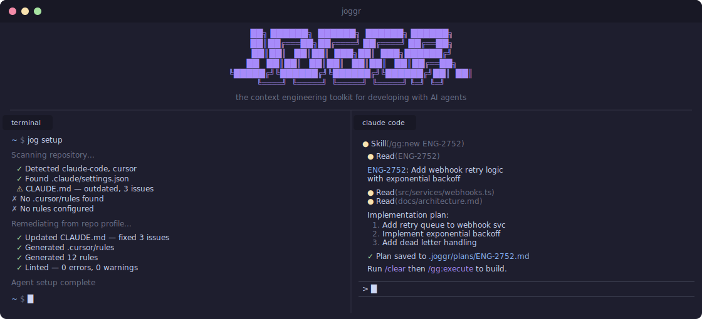

# Joggr

**The context engineering toolkit for developing with AI agents.**

---

## Overview

Build the perfect AI agent setup — automatically. Joggr creates custom coding standards, configures context rules, and maintains instruction files so Claude Code, Cursor, and Windsurf work exactly how you need them to. Stop fighting your agents. Start shipping faster.

**Learn more at [joggr.ai](https://www.joggr.ai)**.

## Roadmap

Explore what we're building. Join the conversation on any feature.

<!-- target:roadmap-table:start -->
| Feature | Status | Discussion |
| ------- | ------ | ---------- |
| [Agent Harness](https://github.com/joggrdocs/home/discussions/2) |  |  |
| [Coding Agent Setup Doctor](https://github.com/joggrdocs/home/discussions/1) |  |  |
| [Coding Agent Toolkit MCP (Serena)](https://github.com/joggrdocs/home/discussions/6) |  |  |
| [Coding Standards Generation](https://github.com/joggrdocs/home/discussions/12) |  |  |
| [GG Workflow](https://github.com/joggrdocs/home/discussions/18) |  |  |
<!-- target:roadmap-table:end -->

**[View full roadmap →](./docs/roadmap/overview.md)**

## Community

- [Discussions](https://github.com/joggrdocs/home/discussions) -- ask questions, share ideas, and connect with other developers.
- [Issues](https://github.com/joggrdocs/home/issues) -- report bugs or request features.
- [Roadmap](https://github.com/orgs/joggrdocs/projects/9) -- see what we are working on.
- [Contributing](./CONTRIBUTING.md) -- learn how to contribute.
- [Status](https://status.joggr.io) -- check system status and uptime.

## Security

If you discover a security vulnerability, please review our [Security Policy](./SECURITY.md) for responsible disclosure guidelines.

## License

This repository is proprietary software. All rights reserved. Use is subject to Joggr's [Commercial Terms of Service](https://www.joggr.ai/legal/terms). See [LICENSE.md](./LICENSE.md) for details.

For privacy information, see our [Privacy Policy](https://www.joggr.ai/legal/privacy).
