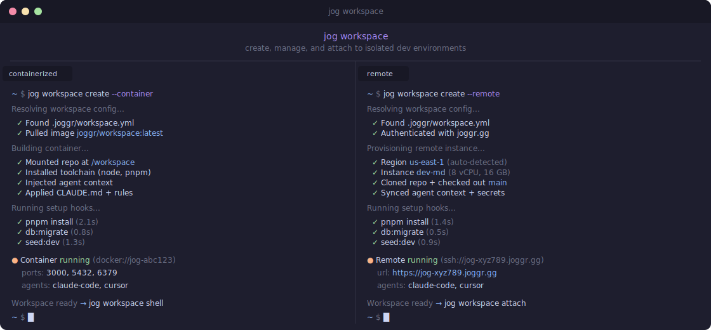

# Workspaces

## Overview

Workspaces give your developers and AI agents a fully isolated, pre-configured development environment that is ready to use in seconds. No manual wiring, no maintenance, no security gaps.

You shouldn't have to spend engineering time building and maintaining a secure dev environment for agents. Workspaces handle isolation, networking, auditing, tooling, and deployment out of the box. Your team ships faster, your agents operate safely, and your security team gets full visibility without any of it getting in the developer's way.

Workspaces scale from a single developer running agents locally to enterprise teams with strict compliance requirements running on their own hardware. Security is always on by default, regardless of how you deploy.

## Features

### Environment & Isolation

- **Full container/pod isolation** - each Workspace runs in its own sandboxed environment, completely separate from your host machine and other Workspaces
- **Local sandbox deployment** - run and test code inside the Workspace without any manual setup or external deployment targets
- **Authenticated preview URLs** - each Workspace can expose authenticated URLs for testing frontends, APIs, and services running inside the environment
- **Automated setup** - each Workspace automatically runs your setup steps on creation (dependency installs, database migrations, seed data, file copies) so it's ready to use immediately
- **Clean environment per session** - no state bleeds between Workspaces; every environment starts from a known, reproducible baseline
- **Blast radius containment** - if an agent misbehaves or a dependency is compromised, the damage is contained to that Workspace and can't spread
- **Configurable lifecycle** - Workspaces are ephemeral by default, but can be configured for persistence, session restore, or automatic reboot on failure

### Security & Network Controls

- **Prebuilt network controls** - network access is locked down by default; no outbound calls are made unless explicitly allowed
- **Team-managed domain allowlists** - teams can pre-approve specific domains their agents are permitted to reach
- **Platform pre-approved list** - a curated set of safe, commonly needed domains is included out of the box
- **Full autonomy mode** - agents operate with broad permissions inside the Workspace while the environment's network and isolation controls keep everything contained; agents move fast, nothing leaks out
- **Full machine-level audit logging** - every action taken inside a Workspace is logged at the infrastructure layer, always on, with no developer instrumentation required
- **Credential & secret isolation** - environment variables and secrets are scoped to their Workspace and cannot leak across environments or be accessed by parallel agents

### Access & Tooling

- **VS Code extension** - create, manage, and connect to Workspaces directly from your editor
- **Joggr app & web console** - manage and access Workspaces from the native Joggr application or web console
- **Native, pre-wired tooling** - editors, terminals, language servers, and deployment targets are configured to work together from day one
- **No glue code** - your sandbox, container, and repo are already connected; no custom wiring required
- **Language and stack agnostic** - Workspaces support any language, framework, or monorepo structure
- **Long-term platform maintenance** - integrations are maintained by the platform, not your team; no keeping up with upstream changes or broken setups after upgrades

### Infrastructure as Code

- **Workspace configuration as code** - define Workspace templates, resource limits, network policies, and tooling in version-controlled configuration files
- **Reproducible environments** - every Workspace is created from a declared configuration, eliminating drift and snowflake setups
- **Team and role management** - access controls and Workspace policies are defined in code and managed through a centralized console

### Enterprise & Self-Hosted

- **Run on your own hardware** - enterprise teams can deploy Workspaces on their own infrastructure, not a shared cloud environment
- **Data residency control** - keep all code, secrets, and agent activity within your own network boundary
- **Compliance-ready by default** - audit logs, network controls, and isolation are all in place without requiring custom security configuration
- **Configurable resource limits** - CPU, memory, and disk are configurable per Workspace to match workload requirements
- **Centralized console** - manage Workspaces, policies, and access across your organization from a single control plane

### Agent-Specific Capabilities

- **Designed for concurrent agents** - run multiple agents in parallel Workspaces with full isolation between them; no cross-contamination of state or credentials
- **Agent action auditing** - know exactly what every agent did, in which Workspace, and when; critical for debugging, compliance, and trust
- **Controlled autonomy** - agents can be given broad permissions to operate freely within a Workspace while remaining completely contained by the environment's security controls
- **Reproducible agent environments** - every agent run starts from the same baseline, making agent behavior consistent and debuggable

---

## FAQ

### How are Workspaces different from `--worktree` or existing worktree managers?

Worktree managers give you multiple working copies of a repo. Workspaces give you a full, reproducible development environment with container isolation, automated setup, integrated tooling, and security on by default. A worktree is a directory. A Workspace is everything you need to start working, securely, from the moment it's created.

### Does adding security controls mean a worse developer experience?

No. Workspaces treat security as infrastructure, not workflow overhead. Network controls, action auditing, and isolation are on by default and handled by the platform. Developers and agents get full autonomy within the sandbox because the guardrails are at the infrastructure level, not in their way.

Devs get the speed and freedom they want. Security teams get the controls and visibility they need.

### Can I run agents in Workspaces without worrying about unsafe network calls?

Yes. Network access is deny-by-default at the Workspace level. Teams pre-approve a domain allowlist, and the platform includes a curated set of commonly needed domains out of the box. Everything outside the allowlist is blocked.

Agents can operate with broad autonomy while remaining fully contained by the network controls.

### What is full autonomy mode?

Full autonomy mode lets agents operate with broad permissions inside a Workspace without any manual approval steps. The agent can read, write, execute, and deploy freely within the environment. This is safe because the Workspace's network controls, credential isolation, and audit logging remain enforced at the infrastructure level regardless of what the agent does inside.

### How do Workspaces help with security auditing and compliance?

Every action taken inside a Workspace is logged at the machine level. You get a full audit trail of what any agent or developer did, when, and in which Workspace. All activity within the Workspace falls inside the audit boundary, and developers never have to instrument anything themselves. Logging happens at the infrastructure layer and is always on.

### How are secrets provisioned into a Workspace?

Secrets and credentials are injected into the Workspace environment at creation time, scoped to that Workspace only. They are not exposed to other environments or parallel agents. Secret provisioning is configured as part of the Workspace definition in code.

### What happens when a Workspace crashes or an agent hangs?

Workspaces handle failures based on your configuration. A crashed Workspace can be set to automatically reboot or restart cleanly from the baseline. A hanging agent can be terminated, with the Workspace restored to its last known state or restarted fresh. The specific behavior is defined in your Workspace configuration.

### How do I manage Workspace access across teams and roles?

Workspace policies, access controls, and role assignments are defined in version-controlled configuration files alongside your Workspace templates. The centralized console provides visibility into who has access to what and lets you manage policies across your organization. Changes to access are versioned and auditable like any other infrastructure change.

### Why not just set this up myself with Docker, scripts, and a worktree manager?

You can, but then you're responsible for maintaining it indefinitely.

Rolling your own setup means building and maintaining isolation, networking, sandboxing, auditing, tooling integration, and deployment pipelines. Every time your stack evolves, every time agent behavior changes, every time a new developer joins, you're on the hook.

DIY setups rarely get security right consistently. Network controls get misconfigured. Audit logging gets skipped. Credential scoping gets overlooked. Getting this right at the infrastructure level is genuinely hard.

Workspaces handle all of this as an actively maintained solution so you get a secure agent dev environment without the ongoing engineering and security overhead.

### Does this work for enterprise teams with strict infrastructure requirements?

Yes. Enterprise teams can run Workspaces on their own hardware with full data residency control. Audit logs, network controls, isolation, and resource limits are all configurable. Whether your requirements include air-gapped networks, data sovereignty, or specific compliance frameworks, Workspaces are designed to run within your infrastructure constraints.

### What does "natively integrated tooling" mean in practice?

It means your editors, terminals, language servers, and deployment targets are built into the Workspace and configured to work together from day one. You don't need to connect your sandbox to your container to your repo manually. It's already wired up and ready to use.
