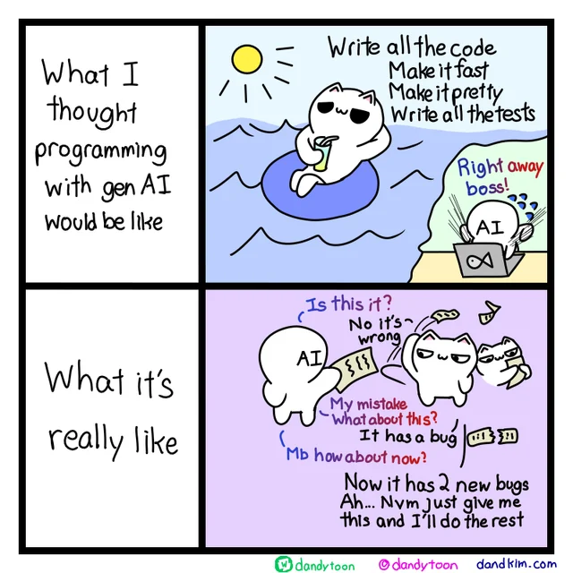

# What coding with AI actually looks like

**The hard part isn't writing code anymore.**

---

When you first start using Claude Code or Cursor, it's genuinely impressive. Features that took a day get scaffolded in minutes.

But after a few weeks, you start noticing where your time actually goes:

- Planning what to feed the model so it has enough context to do the job right
- Reviewing and fixing output that technically works but doesn't follow your team's patterns, conventions, or architecture

Generating code is quick. It's everything around it that takes the real time.

## The bottleneck has moved

The bottleneck used to be writing code. Now it's everything else — planning the work *before* generation and reviewing the work *after*.

- **Upstream** — decomposing features, gathering context, and designing the approach so the model doesn't hallucinate or go off-track
- **Downstream** — reviewing generated code, catching convention violations, validating behavior, and integrating it into the existing codebase

AI tools handle the middle part well. But they don't give you anything for the upstream or downstream — the parts where you're actually spending your time.

## What you end up building yourself

To get AI coding working reliably, you end up building a lot of supporting infrastructure — and then maintaining it as your codebase evolves.

### Planning and context

- **Work breakdown** — You manually decompose features into steps, decide what code and docs to feed into each step, and re-orient the model when it loses the thread. This gets painful fast on anything beyond a single-file change.

- **Agent memory** — Instruction files only go so far. In practice, you're constantly re-teaching the model: *stop using X, we switched to Y.* That means writing docs, updating rules, and editing instruction files every time a decision changes — and none of it transfers across tools or scales across your team.

How Joggr helps

- [GG Workflow](https://github.com/joggrdocs/home/issues/24) — structures planning, execution, and review into a repeatable workflow
- [Context MCP: Internal](https://github.com/joggrdocs/home/issues/16) — aggregates repo structure, docs, and project metadata into structured context for agents
- [Context MCP: External](https://github.com/joggrdocs/home/issues/15) — aggregates external documentation sources into a single search endpoint

### Codebase understanding

- **Documentation** — Architecture and system docs have to stay current so the model actually understands how your codebase works. Stale docs produce stale code.

- **Instruction files** — Repo-wide and subdirectory-level rules need to be defined and maintained as the codebase evolves. Someone has to write them, and someone has to keep them accurate.

- **Coding standards** — How your team writes code needs to be encoded into rules and kept consistent with what's actually in the repo. Otherwise the model generates code that *works* but doesn't *fit*.

How Joggr helps

- [Coding Standards Generation](https://github.com/joggrdocs/home/issues/12) — generates codebase-aware standards docs based on detected patterns
- [Coding Standards Rules](https://github.com/joggrdocs/home/issues/14) — generates and updates rules that guide agents to follow your standards
- [Coding Agent Setup CLI](https://github.com/joggrdocs/home/issues/6) — walks you through setup for instruction and config files
- [Documentation Doctor: Missing](https://github.com/joggrdocs/home/issues/19) — detects missing core documentation
- [Documentation Doctor: Drift](https://github.com/joggrdocs/home/issues/18) — identifies docs that are outdated or inconsistent with the codebase

### Execution and control

- **Configs and permissions** — You have to configure tools, permissions, and environments — and more importantly, *prevent* the model from doing the wrong thing. Unsafe commits, unauthorized actions, and unscoped access all need guardrails.

- **Agent rules** — Instructions and skills aren't always enough. The model won't reliably follow them, so you need enforcement mechanisms on top — another layer to build and maintain.

- **Agent environments** — Once agents execute real work (editing files, running commands, calling services), you need isolated environments with sandboxing, network controls, and scoped credentials.

How Joggr helps

- [Coding Agent Setup Doctor](https://github.com/joggrdocs/home/issues/7) — analyzes repos for misconfigured AI development setup
- [Coding Agent Setup Remediation](https://github.com/joggrdocs/home/issues/9) — auto-generates fixes for doctor findings
- [Coding Agent Quality Checks](https://github.com/joggrdocs/home/issues/5) — installs and maintains hooks that validate agent-touched code
- [Workspaces: Containers](https://github.com/joggrdocs/home/issues/26) — provides isolated container environments for safer agent execution
- [Secure Data Access Layer](https://github.com/joggrdocs/home/issues/30) — scopes and controls access to external systems

### Review and validation

- **Code quality** — Linting, tests, and checks still have to pass, and you end up spending real time reviewing AI-generated code that doesn't follow your conventions.

- **Review workflow** — You're jumping between your editor and AI tools, copying context back and forth, coordinating feedback by hand. The whole thing is fragmented, and it gets worse as the volume of generated code goes up.

How Joggr helps

- [GG Local Code Review](https://github.com/joggrdocs/home/issues/22) — a web UI for viewing, annotating, and approving generated code locally
- [GG Plan Review](https://github.com/joggrdocs/home/issues/23) — a web UI for viewing, annotating, and approving workflow plans
- [Coding Standards PR Check](https://github.com/joggrdocs/home/issues/13) — detects stale standards docs and rules on every PR
- [Coding Agent Setup PR Check](https://github.com/joggrdocs/home/issues/8) — flags outdated agent configs on every PR

## It keeps growing

None of this is one-time setup. It all has to stay in sync as your codebase evolves, hold together across multi-step workflows without drifting, and scale across every repo your team touches.

If you try to solve it with custom skills or scripts, you hit real limits:

- A fully configured repo needs 50+ of them
- They behave differently across providers (Claude, Cursor, Windsurf), locking you into one tool
- Some problems aren't solvable with skills at all — orchestrating multi-step features or building a review workflow requires actual tooling

And that's just one repo. Multiply it across a team and you're maintaining a small internal platform.

At that point, you're not just *using* AI to code — you're maintaining a platform to make AI code reliably. You've become the platform team for your own AI tools.

## Where Joggr fits

Before CI/CD platforms existed, every team hand-rolled their own build-test-deploy process. Jenkins jobs, bash scripts, cron tasks, custom webhooks — it worked, but you were spending real engineering time maintaining infrastructure that had nothing to do with your product. Then tools like GitHub Actions and GitLab CI standardized that entire layer. You declared what you wanted and stopped maintaining the machinery.

AI development is at that same inflection point.

**Joggr is the context engineering toolkit for developing with AI agents.** It handles the setup, context, coordination, and ongoing maintenance that make AI coding actually work — so your team stops building internal tooling and gets back to building the product.

